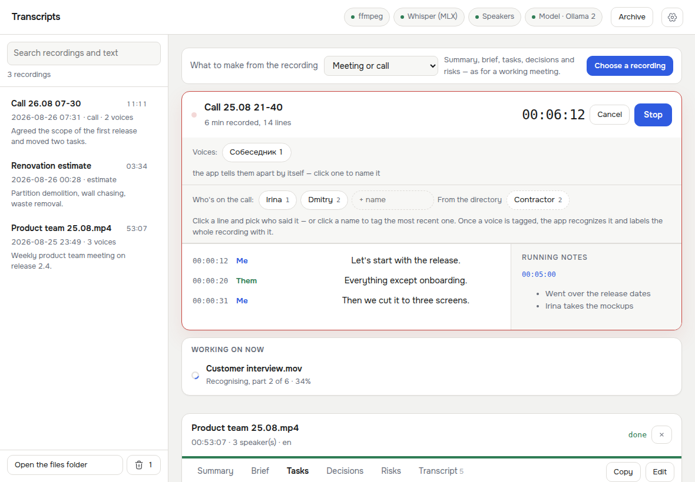
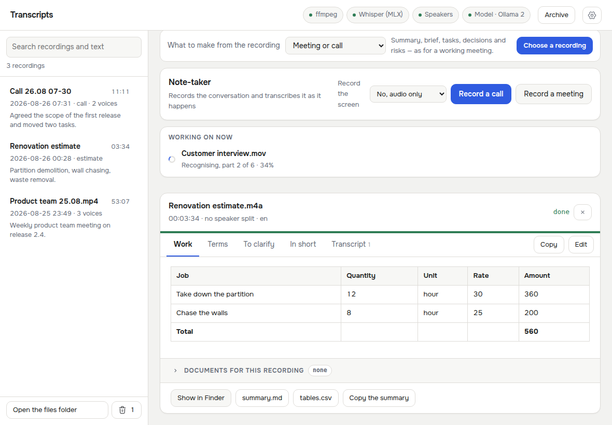

# Transcripts — local transcription for macOS

Turn a recording of a meeting, call or voice note into a timestamped transcript
with speaker labels, a summary, a brief, action items and decisions — entirely on
your own Mac.

**Nothing leaves your computer.** Speech recognition runs on Whisper, speaker
separation on sherpa-onnx, and the summary on a language model you plug in
yourself. The internet is needed once, to download the models.

[](https://github.com/Darkheart06/video-to-text/actions/workflows/ci.yml)
[](LICENSE)


🇷🇺 [Читать по-русски](README.ru.md)



## What it does

- **Transcribes** video and audio — `mp4`, `mov`, `webm`, `mkv`, `avi`, `m4v`,
  `mp3`, `m4a`, `wav`, `flac`, `ogg`, `opus`, `aac`.
- **Tells voices apart** and lets you rename speakers; the labels are rewritten
  into every output file.
- **Records live calls** through ScreenCaptureKit — your microphone and the
  system audio as two separate tracks — transcribing as the conversation goes and
  writing running notes.
- **Summarises** into whatever you need: a meeting brief, a cost estimate with a
  recalculated total, a structured voice note, a user-interview digest, or your
  own rules written in plain language.
- **Keeps an archive** of everything already processed, searchable by title and
  by the text inside the transcripts.
- **Does the arithmetic itself.** Language models are confidently wrong at
  multiplication, so tables are recomputed in Python and exported as CSV.

## Requirements

| | | |
|---|---|---|
| macOS 13+ | Apple Silicon strongly preferred | Intel works, slower |
| Python 3.9+ | usually already installed | `brew install python@3.12` |
| ffmpeg | to pull audio out of video | `brew install ffmpeg` |
| A language model | for summaries only | [see below](#connecting-a-language-model) |

Without a language model the app still works — it just does not summarise.

## Install

```bash
git clone https://github.com/Darkheart06/video-to-text.git
cd video-to-text
bash install.sh
```

The script walks through the steps and asks before every large download: it
checks Python and ffmpeg, creates a `.venv`, installs the libraries, fetches the
speaker-separation models, helps you set up a language model and builds
`Расшифровка.app` — the bundle keeps its Russian name for now, the window inside
is English.

### Giving it to someone without a terminal

```bash
bash packaging/make-dmg.sh
```

`dist/` gets a small `.dmg` containing an installer app that downloads Python,
ffmpeg and the models by itself and puts the application into `/Applications`.
The image is signed with a self-signed certificate, so on another Mac it has to
be opened once with **right click → Open**.

## Connecting a language model

Three ways, switched under **Settings → How the model is connected**. The
“Test the connection” button really calls the model and shows its answer.

**1. Ollama** — the path of least resistance:

```bash
brew install --cask ollama
ollama pull gemma4:12b-mlx
```

Nothing else to configure: the app finds Ollama on `127.0.0.1:11434` and picks
the best installed model.

**2. A `.gguf` file on disk** — point the app at the file, no server involved.
Needs `llama-cpp-python`, which `install.sh` offers to build:

```bash
CMAKE_ARGS="-DGGML_METAL=on" .venv/bin/pip install llama-cpp-python
```

**3. Any OpenAI-compatible server** — LM Studio, `llama-server`, Jan, LocalAI.
Give it the base URL (`http://127.0.0.1:1234/v1`), the model name and a key if
one is required. The same path works with a cloud provider, if you knowingly
want to send transcripts out.

### Choosing a model for your memory

The model has to fit in RAM with three or four gigabytes to spare for the system
and the app itself.

| Mac memory | Sensible choice | Size |
|---|---|---|
| 16 GB | `gemma4:e4b` | ~10 GB |
| 24 GB | `gemma4:12b` | ~8 GB |
| 32–48 GB | `gemma4:12b`, `gemma4:26b` if you have room | 8 / 19 GB |
| 64 GB+ | `gemma4:26b` or `gemma4:31b` | 19 / 20 GB |

On Apple Silicon, models with an `-mlx` suffix are built for Metal and are
noticeably faster.

**Count occupied memory, not file size.** At a 32K context `gemma4:12b-mlx`
occupies **16 GB** while weighing 7.7 GB — the rest is the context cache. On a
24 GB Mac that is already tight, and a 27B model does not fit at all, whatever
the reviews about 24 GB graphics cards say.

**Measured on a real call** (51 minutes, 40 000 characters of transcript,
M4 Pro / 24 GB, `tools/modeltest.py`):

| Model | Memory | Time | Result |
|---|---|---|---|
| `gemma4:12b-mlx` | 16 GB | 186 s | even summary, but deadlines in tasks mostly “—” |
| `qwen3.5:9b-mlx` | 9.3 GB | 182 s | a quarter more detail, picked up deadlines and conditions |

For 24 GB: `qwen3.5:9b-mlx` — same speed, more specifics, seven gigabytes less
memory. Check it on your own recording:

```bash
python tools/modeltest.py "~/Documents/Transcripts/Call.result.json" \
    gemma4:12b-mlx qwen3.5:9b-mlx
```

## Two languages

The interface and the documents speak English or Russian, and they are set
separately — the window can be English while the summaries stay Russian, because
those are two different questions. The window is for whoever presses the buttons;
the document language is for whoever will read the brief, and it decides how the
model writes, what the output folder is called (`Transcripts` or «Расшифровка
записей») and whether the totals row says “Total” or «Итого».

On first launch both follow the system: a Russian Mac gets a Russian window,
anything else gets English. **Settings → Language** switches them at any time,
and the window redraws without a restart. The archive reads both folders, so
nothing is lost when you switch.

Recognition is a separate thing: **Recording language** in the settings is the language spoken
in the recording, and Whisper handles far more than these two.

## Using it

Drop a file into the window, or press **Choose a recording**. Pick at the top what
should come out of the recording, and watch the stages go by; at the end you get
tabs with the sections of the chosen profile plus the transcript.

### Profiles

| Profile | What you get |
|---|---|
| **Meeting or call** | summary, brief, decisions, tasks, risks |
| **Estimate from dictation** | a table of work items with rates and a total |
| **Voice note** | thoughts by topic, tasks, numbers that were said |
| **User interview** | pains, verbatim quotes, conclusions |
| **Your own rules** | whatever you describe in your own words |

For the estimate, just dictate it: “demolition — twelve hours at three thousand,
wall chasing — eight hours at twenty-five hundred”. The model only sorts that
into columns; the multiplication and the total are done in Python, and a
`.tables.csv` lands next to the summary.

With **Your own rules** you write the instructions in one field and a document
template in the other. Every `##` heading in the template becomes a tab in the
window and a section in the file.



### Recording a call

Press **Record a call** (the app also offers this by itself when it
notices the microphone is busy). macOS will ask for Screen Recording permission —
that is what gives access to the system audio; the button in the app opens the
right settings pane directly.

Your microphone and the system output are captured as two separate tracks, so
“me” and “them” never get confused with each other. While the call is running,
everyone on the other side is simply “Them”; when you stop, the system
track is separated by voice and the finished transcript has “Person 1”,
“Person 2” and so on (or «Собеседник 1» in Russian).

### Voices while you record

Voices are told apart **as the conversation goes**, not afterwards: every line
long enough to leave a voice print is compared against the ones heard so far and
gets a number right away — “Speaker 1”, “Person 2”. The row above the transcript
shows them, and clicking one renames the whole voice: one name instead of a dozen
tags, and every line that person said — before and after — takes it.

The threshold errs towards one voice too many rather than one too few. Two chips
with the same name merge with a single click; two people fused into one voice
cannot be separated at all. Measured on a public four-speaker sample with 2–5
second lines: at 0.50 it found two voices and merged different people 22 times,
at the default 0.62 it found five and merged four times. When the recording
stops, the whole file is separated properly anyway, which is more accurate than
anything possible live.

One person should not spread across three "speakers", and three rules work
against that: the voice that spoke a moment ago gets a head start (people do not
change mid-sentence); voices that turn out to be the same person are folded
together as the conversation goes; and once you have listed who is on the call,
the app stops creating more voices than there are people (plus one spare). And
the simplest one: two chips with the same name are one person, so they merge.

Names can also be tagged by hand: type them into the “+ name” field and press a
name to tag the latest line, or click a line and pick the person. Keys 1–9 do the
same without reaching for the mouse.

One tagged line per person is enough. When the recording stops, the app compares
the tagged speech against everything else and labels the whole transcript with
real names instead of “Speaker 2”.

The comparison runs per line rather than against an averaged cluster voice, and
what decides it is the gap between the best and second-best match, not the
absolute similarity: on a real recording a speech fragment matched its own
cluster's average at 0.52 while a different person scored 0.40. No gap, no name —
“Speaker 2” beats someone else's name on someone else's words.

### Familiar voices

Separation works inside a single recording: it shows which lines belong
together, not whose they are. The name has to be typed again every time — even
though you talk to the same people week after week.

So there is memory between recordings. Open a processed recording, check that
the names are right, and press **Remember voices** — from then on those people
are recognised on their own: the name shows up in the live transcript the moment
they speak, and in the finished files and summary without a single click.

**Learning only ever starts on command**, deliberately so. One splitting
mistake, learned silently, would stay forever: the app would decide that Leonid
sounds like the woman he was talking to and label every later call that way. So
you look at the names first, and press the button second.

Only real names are remembered: “Speaker 2” and “Person 1” mean nothing and are
skipped. One name goes to one voice per recording — if two voices look like
Leonid, the closer one takes the name and the other keeps its number. Settings
lists everyone the app knows, forgets any of them with one click, and can switch
recognition off entirely.

There is no fine-tuning here, and none is needed: the model is not changed, a
few vectors per person are stored next to it — the same ones the app already
compares inside a recording. Fine-tuning would take hours of speech per person
and a GPU, and would help exactly where nothing goes wrong today.

The same from the console:

```bash
./run.sh --learn "~/Documents/Transcripts/Call 26.08.result.json"
./run.sh --voices          # who the app recognises
./run.sh --forget Leonid   # forget a voice
```

### Recording a room meeting

“Record a meeting” sits next to the call button. It captures the microphone only
and needs no Screen Recording permission — around a table every voice reaches the
same microphone anyway. When it stops, the recording is separated by voice like
any other file, and names tagged during the meeting are applied throughout.

### Editing the summary

Models sometimes drag in things that were not discussed, or an action item nobody
assigned. The **Edit** button above the text turns on pointwise editing:
a cross removes a bullet or a table row, and the text itself is editable in place.
Saving rewrites the summary and the tables, and totals in estimates are
recalculated.

**The transcript is never touched.** What was said stays as it was said — only the
derived document changes.

### Recording titles

Recordings are named after what was discussed rather than “Call 2026-08-27
13-32”. The same model that writes the summary suggests the title, and it goes in
front of the timestamp — “Gamification logic 2026-08-27 13-32” — so recordings
still sort by time. If the model does not answer, the old name stays.

### Deadlines become dates

In a conversation deadlines are spoken, not written: “by tomorrow”, “end of the
month”, “on Friday”. A week later none of that means anything in a task list, so
the date of the recording is used to work out what was meant and the answer is
appended in brackets — “tomorrow (August 28)”. The words that were said stay
where they were.

The arithmetic is done in Python. Models are as confidently wrong about dates as
they are about multiplication, and only in table columns that are about
deadlines — inside prose, “by Friday” may be a quote rather than a commitment.

### How many voices there are

After separation the app compares the voices against each other and merges the
clusters that turn out to be the same person. The question is what counts as
“the same”, and a number in the settings cannot answer it: how similar two
fragments of one person are depends on the microphone, the room and the
connection — on one recording it is 0.95, on another 0.70.

So the reference is taken from the recording itself. Each voice's speech is cut
in two, the halves are compared, and “how similar is a person to themselves
*here*” becomes the reference; the threshold sits a margin below it. That number
also says how far the voice prints can be trusted at all: at 0.95 they are
steady and the threshold can be raised close to it, at 0.70 different people
easily reach 0.8 and merging must stay timid. **The threshold therefore only
goes up** — never below `speaker_merge_similarity` — so at worst separation
behaves as it did before, and on a clean recording it is more careful.

The halves are dealt alternately rather than split by time: if a cluster
actually holds two people, both land in both halves, and the error again goes
the safe way.

`speaker_merge_auto: false` goes back to the fixed `speaker_merge_similarity`.
If you know the number of participants, say so — **How many speakers** turns all
of this off and is always more accurate than guessing.

Check it on your own recordings, with or without the right answer:

```bash
python tools/speakertest.py "~/Documents/Transcripts/Call.wav" --было 4    # «--было» = how many there really were
python tools/speakertest.py "~/Documents/Transcripts" --список truth.txt
```

### Screen recording and markers

People share their screen on calls: a mockup, a spreadsheet, a bug in the
interface. Next to the record button you choose what to capture — **audio
only**, **the whole screen**, or **one running app**. The video goes through the
same ScreenCaptureKit stream as the system audio, so there is no extra
permission and no virtual driver. It is written at 8 fps and 1600 px wide: this
is a screen share, not a film, so an hour costs hundreds of megabytes rather
than tens of gigabytes.

The finished recording plays inside the card, with **markers** above the player
where the things that made it into the document were said: a decision, a task, a
risk, a note taken during the call. Click a marker and the recording plays from
there — chapters, the way YouTube does them.

**Marker times come from the transcript, not from the model.** Asking a model
“when was this said” is a reliable way to get a plausible invented number. Every
item is matched against the lines by wording, and an item with no convincing
match gets no marker: an empty spot is honest, a marker pointing at the wrong
minute is not.

Markers are also saved as `<recording>.chapters.vtt`, which players, YouTube and
editing software understand.

### Documents attached to a recording

A call is almost never self-contained: people discuss an estimate, a brief, an
email from the client, and the transcript is left saying “as in that document”.
A week later “fix it per the comments” means nothing.

The **Documents for this recording** block on the card (collapsed, opens on
click) attaches files to the recording. Their text goes to the model together
with the transcript, so the summary carries the real names, figures and wording.
**Rebuild the summary with the documents** re-runs only the summary — the
transcript is untouched, because it has not changed.

Pictures and documents sit on separate shelves: screenshots and photos are
square previews that open full-size on click (Escape closes), while documents
stay a list and open in whatever app owns them. **Edit the list** switches the
block from viewing to removing, so a stray click deletes nothing.

Files are copied next to the recording, into `<recording>.files`: renaming or
deleting the original leaves the record whole. Text is pulled from `.pdf`,
`.docx`, `.pptx`, `.xlsx`, `.txt`, `.md`, `.csv` and `.rtf`; anything else just
sits there and opens on click.

### A directory of people and teams

Participants had to be typed in again before every call, though you talk to the
same people — and usually to a whole team. Settings → **People and teams** keeps
who works where, and marks whose voice the app already remembers.

During a call the teams from the directory appear next to “Who's on the call”:
one press puts everyone from that team on the list, and correcting it is cheaper
than typing it. The 1–9 keys for tagging lines work off that same list.

### One recording in the working area

The middle of the window shows exactly the recording you opened — from the list
on the left, or the one you just started. Cards used to stack into a feed, and
it stopped being obvious which one you were looking at. Anything still being
processed is collected into a single “Working on now” line above the recording;
clicking it opens that job.

### The trash, and getting a recording back

The cross next to a recording is now a trash icon, and deleting stopped being
final: the whole recording — audio, transcript, summary — goes to the app's own
trash. The button at the bottom of the archive opens it: each entry shows how
long it has left, **Put back** returns it where it came from, **Delete** removes
it for good, **Empty** clears everything.

Anything left for **30 days** goes on its own (`trash_days` in settings; `0`
never sweeps). Before this the files went to the system Trash, where putting
them back meant hunting through Finder by filename.

### Processing no longer blocks the next call

Splitting voices and writing the summary takes minutes, and the recorder used to
be busy for all of it: a call starting right after another simply could not be
recorded. Processing now has its own queue — it steps aside the moment a new
recording starts and resumes exactly where it stopped. Recordings waiting their
turn are listed under the live card, so nothing looks lost.

The pause happens between stages, not inside one: Whisper cannot be stopped
mid-chunk, but between “collect the audio”, “split the voices” and “summarise”
it can, and you do not notice.

### Archive

The panel on the left lists everything already processed — files and recorded
calls alike. Click one and it opens back into the same tabbed view. The search
box matches titles, and from three letters up it also searches inside the
transcripts. There is no separate database: the list is built from the
`.result.json` files, so it survives a reinstall.

### Command line

```bash
./run.sh meeting.mp4                          # defaults
./run.sh *.mov --speakers 3                   # you know there are three
./run.sh lecture.m4a --no-speakers            # single voice
./run.sh estimate.m4a --preset estimate       # work items with a total
./run.sh note.m4a --preset note
./run.sh --check-llm                          # test the model connection
./run.sh --learn call.result.json             # remember the voices in it
./run.sh --voices                             # who the app recognises
./run.sh meeting.mp4 --gguf ~/Models/gemma-4-12b-Q4_K_M.gguf
```

## Output

For `meeting.mp4`, in `~/Documents/Transcripts` (or «Расшифровка записей» in Russian):

| File | Contents |
|---|---|
| `meeting.summary.md` | the sections of the chosen profile |
| `meeting.tables.csv` | recomputed tables, when there were any |
| `meeting.transcript.md` | transcript with timestamps and speakers |
| `meeting.transcript.txt` | the same as plain text |
| `meeting.subtitles.srt` | subtitles |
| `meeting.result.json` | everything together — also what the archive reads |

## Configuration

The **Settings** button, or `config.json` next to the project.

- **Language** — the window language and, separately, the language of summaries,
  folders and file names. `auto` follows the system.
- **Recording language** — `auto` guesses; naming the language is faster and more accurate.
- **Whisper model** — `large-v3-turbo` is the sensible default.
- **How many speakers** — `0` detects automatically; an exact number is cleaner
  when you know it.
- **Splitting threshold** — lower means more speakers. After separation the app
  compares the voices against each other anyway and merges clusters that turned
  out to be the same person (`speaker_merge_similarity`, `0.78` by default;
  `1.0` disables it). On a real half-hour meeting this took 28 “speakers” down
  to seven. The threshold is then tightened per recording — see
  [How many voices there are](#how-many-voices-there-are).
- **Context size** — how much text the model holds at once.

## How long it takes

For an hour of audio on Apple Silicon: 3–8 minutes of recognition with
`large-v3-turbo` through MLX, 1–3 minutes of speaker separation, 1–4 minutes of
summarising. The first run is slower — the Whisper model (~1.5 GB) is downloaded
once into `~/.cache/huggingface`.

## How it works

```
file → ffmpeg (mono 16 kHz) → Whisper       (text + word timings)
                            → sherpa-onnx   (who spoke when)
                            → merge by word (turns)
                            → language model (map-reduce → final document)
                            → .md / .csv / .txt / .srt / .json
```

[docs/roadmap.md](docs/roadmap.md) lays out what comes next and what breaks at
scale. [docs/architecture.md](docs/architecture.md) explains the decisions behind
that line — why sherpa-onnx and not pyannote.audio, why the summary is markdown and
not JSON, why arithmetic never touches the model, and what was measured on real
recordings.

## Development

```bash
python tools/selftest.py sample.mp4   # whole pipeline, stubbed ASR and LLM
python tools/uicheck.py               # interface in a headless browser
python tools/speakertest.py rec.m4a --было 4     # how many voices, and how far off
python tools/modeltest.py rec.result.json qwen3.5:9b-mlx gemma4:12b-mlx
ruff check .
```

`tools/selftest.py` runs the real speaker separation and fakes only Whisper and
Ollama, so it is fast and still catches real breakage. `tools/uicheck.py` drives
the interface with Playwright in both light and dark themes and writes
screenshots.

Contributions are welcome — see [CONTRIBUTING.md](CONTRIBUTING.md).

## License

[MIT](LICENSE) — use it, change it, ship it, for free.

Two things in here are not mine, and both ship inside the app rather than
being fetched from anywhere:

- **The Onest typeface** — SIL Open Font License, text in
  [app/ui/fonts/LICENSE-Onest.txt](app/ui/fonts/LICENSE-Onest.txt).
- **The Iconsax icons** by Vuesax, outline style — CC BY 4.0, i.e. with
  attribution. Details, and one contradiction in the terms, in
  [app/ui/icons/LICENSE-Iconsax.md](app/ui/icons/LICENSE-Iconsax.md).
